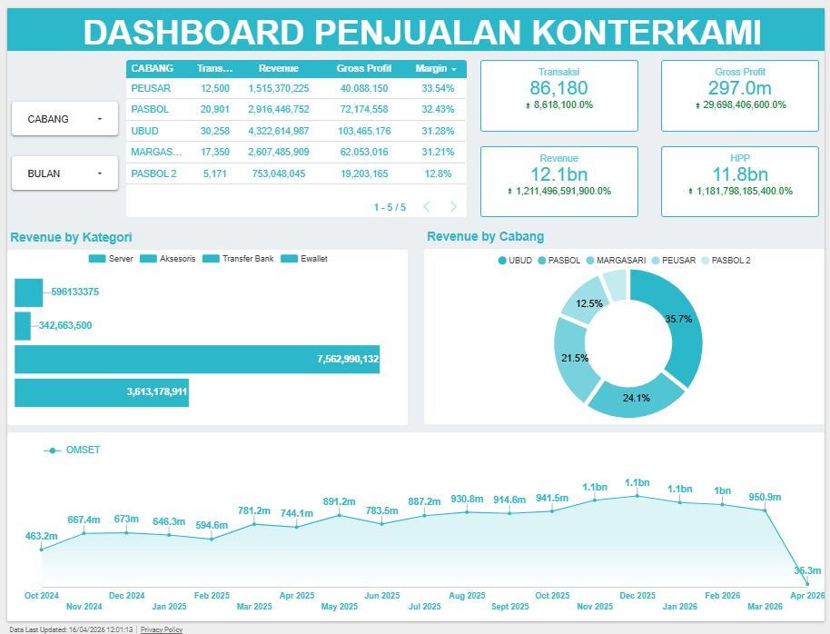
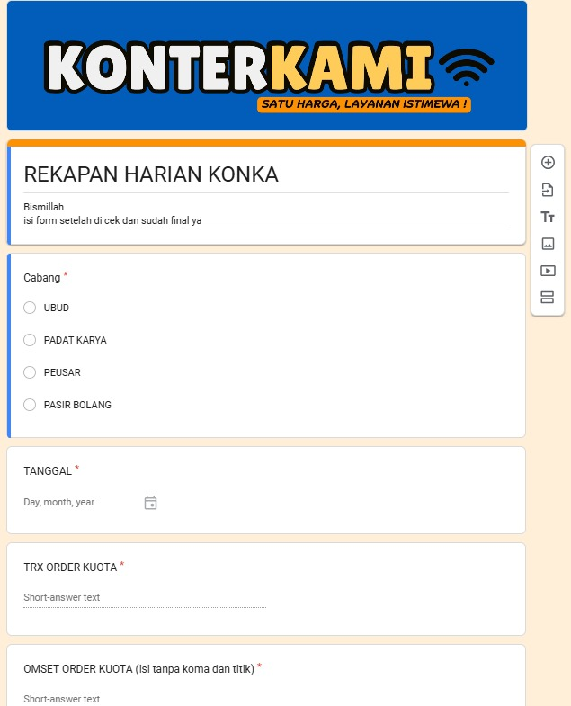
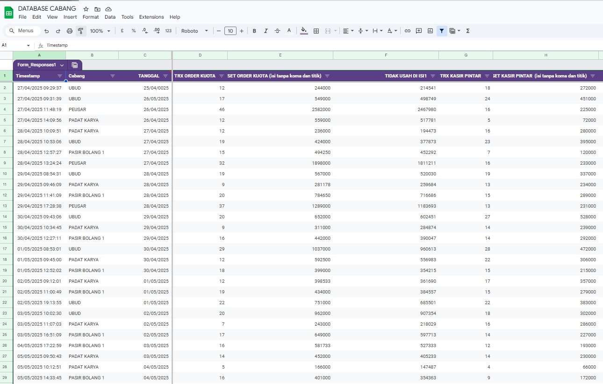

# Dashboard Penjualan (data visualisasi)

Sistem sederhana untuk mencatat, menyimpan, dan memvisualisasikan data penjualan secara otomatis menggunakan Google Form, Google Spreadsheet, dan Looker Studio.

Sistem ini membantu monitoring penjualan secara real-time, lebih rapi, dan terpusat.

---

## Tampilan Sistem

---

## Struktur Sistem

Sistem ini terdiri dari 3 modul utama:

---

## 1. INPUT DATA (Google Form)

Modul pertama digunakan untuk pengumpulan data penjualan.

### Tampilan Input

### Fungsi:
- Input data penjualan secara cepat
- Bisa diakses dari mana saja
- Data langsung masuk ke database otomatis

👉 Semua data otomatis masuk ke Google Spreadsheet

---

## 2. DATABASE (Google Spreadsheet)

Modul kedua sebagai pusat penyimpanan semua data penjualan.

### Tampilan Database

### Fungsi:
- Menyimpan seluruh data dari Google Form
- Menjadi single source of truth
- Bisa diolah dengan rumus, pivot, atau filter

👉 Data ini menjadi sumber utama dashboard

---

## 3. VISUALISASI (Looker Studio)

Modul ketiga untuk menampilkan data dalam bentuk dashboard interaktif.

### Tampilan Dashboard

### Fungsi:
- Visualisasi data penjualan
- Monitoring performa real-time
- Filter berdasarkan cabang, produk, atau waktu

### Insight yang ditampilkan:
- Total penjualan
- Grafik penjualan per bulan
- Kategori Produk terlaris
- Performa cabang

👉 Dashboard selalu update otomatis saat data masuk

---

## Teknologi yang Digunakan

- Google Forms → Input data
- Google Sheets → Database utama

---

## Tujuan Sistem

- Mengotomatisasi input data penjualan
- Mengurangi input manual
- Monitoring penjualan real-time
- Membantu analisis bisnis berbasis data

---

## Kelebihan Sistem

- No-code system (tanpa coding)
- Real-time update
- Mudah digunakan
- Cocok untuk UMKM hingga bisnis multi-cabang
- Bisa dikembangkan ke sistem KPI & reporting

---

## Catatan Penting

- Google Form harus terhubung ke Google Spreadsheet
- Looker Studio harus connect ke Spreadsheet sebagai data source
- Struktur kolom harus konsisten agar dashboard tidak error
- Pastikan permission akses sudah diatur dengan benar
